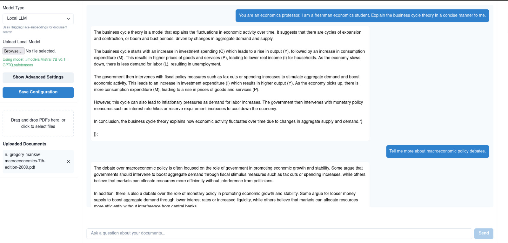

# PDF Chat Application

A modern web application for chatting with PDF documents using various LLM models. The application is built with a React frontend and FastAPI backend.



## Features

- Upload and process multiple PDF documents
- Chat interface with streaming responses
- Support for both OpenAI GPT-3.5 and local LLM models
- Advanced model configuration options
- Real-time chat updates
- Document source tracking

## Project Structure

```
pdf_chat/
├── backend/
│   ├── app/
│   │   ├── api/
│   │   │   └── routes/
│   │   │       ├── pdf.py
│   │   │       ├── chat.py
│   │   │       └── model.py
│   │   ├── core/
│   │   ├── models/
│   │   ├── services/
│   │   └── utils/
│   ├── requirements.txt
│   └── README.md
├── frontend/
│   ├── src/
│   │   ├── components/
│   │   │   ├── FileUploader.tsx
│   │   │   ├── ChatInterface.tsx
│   │   │   └── ModelConfigPanel.tsx
│   │   ├── store/
│   │   ├── api/
│   │   └── types/
│   ├── package.json
│   └── README.md
└── README.md
```

## Setup Instructions

### Backend Setup

1. Create a virtual environment:
```bash
python -m venv venv
source venv/bin/activate  # On Windows: venv\Scripts\activate
```

2. Select the llama-cpp-python that your hardware supports:

Go to requirements.txt and uncomment the llama-cpp-python dependency.

For CPU-only usage:
```bash
llama-cpp-python
```

For CUDA GPU support (recommended for faster inference):
```bash
# Make sure you have CUDA toolkit installed
CMAKE_ARGS="-DGGML_CUDA=on" llama-cpp-python
```

For Metal GPU support (Apple Silicon):
```bash
CMAKE_ARGS="-DGGML_METAL=on" llama-cpp-python
```

3. Install the dependencies:
```bash
cd backend
pip install -r requirements.txt --no-cache-dir
```

4. Set up environment variables:
```bash
cp .env.example .env
# Edit .env with your OpenAI API key and other configurations
```

5. Run the backend server:
```bash
uvicorn app.main:app --reload
```

### Frontend Setup

1. Install dependencies:
```bash
cd frontend
npm install
```

2. Set up environment variables:
```bash
cp .env.example .env
# Edit .env with your backend API URL
```

3. Run the development server:
```bash
npm run dev
```

## API Documentation

The backend API is documented using OpenAPI/Swagger. Once the backend server is running, visit:
```
http://localhost:8000/docs
```

### Key Endpoints

- `POST /api/pdf/upload`: Upload and process PDF documents
- `POST /api/chat/stream`: Stream chat responses
- `POST /api/model/configure`: Configure model parameters
- `POST /api/model/upload-local`: Upload local LLM model

## Usage Guide

### Using OpenAI GPT-3.5

1. Configure the model:
   - In the web interface, select "OpenAI GPT-3.5" as the model type
   - The application will automatically use OpenAI embeddings for document search
   - No additional model upload is required

2. Upload PDFs:
   - Click the "Upload PDF" button or drag and drop PDF files
   - Wait for the processing to complete
   - You can upload multiple PDFs at once

3. Start chatting:
   - Type your questions in the chat interface
   - The model will search through your uploaded documents and provide relevant answers
   - Responses will include references to the source documents

### Using Local LLMs

1. Prepare your model:
   - Supported formats: `.gguf`, `.safetensors`, `.bin`, `.pt`, `.pth`
   - Recommended: Use GGUF format for best performance with llama.cpp

2. Configure the model:
   - In the web interface, select "Local LLM" as the model type
   - Click "Upload Local Model" and select your model file
   - The application will automatically use HuggingFace embeddings for document search

3. Adjust model parameters (optional):
   - Temperature: Controls randomness (0.1-2.0)
   - Max Tokens: Maximum length of generated responses
   - Top P: Controls diversity via nucleus sampling (0-1)
   - Repeat Penalty: Reduces repetition (1.0-2.0)
   - Context Length: Maximum context window size
   - GPU Layers: Number of layers to offload to GPU (-1 for CPU only)

4. Upload PDFs and chat:
   - Follow the same steps as with OpenAI GPT-3.5
   - Note that local models may have different performance characteristics
   - Some models may work better with specific types of documents

### Tips for Best Performance

- For local LLMs:
  - Use models quantized to 4-bit or 8-bit for better memory efficiency
  - Adjust GPU layers based on your GPU memory capacity
  - Start with a smaller context length if experiencing memory issues
  - Use models fine-tuned for instruction following for better chat performance

- For OpenAI GPT-3.5:
  - Keep API key secure and monitor usage
  - Consider using streaming responses for better user experience
  - Break down complex questions into smaller parts if needed

## Development

### Backend Development

- The backend uses FastAPI
- Core LLM logic is separated into services
- PDF processing is handled asynchronously
- Model configuration can managed through environment variables. Set up a .env file to manage model configuration.
Alternatively, just use the default values in the Settings class.

### Frontend Development

- Built with React and TypeScript
- Uses Chakra UI for modern, accessible components
- State management with Zustand
- Real-time updates with streaming responses

## Running Tests

### Backend Tests

1. Make sure you have activated your virtual environment:
```bash
source venv/bin/activate  # On Windows: venv\Scripts\activate
```

2. Navigate to the backend directory:
```bash
cd backend
```

3. Run unit tests:
```bash
pytest tests/unit
```

4. Run integration tests:
```bash
pytest tests/integration
```

5. Run all tests with coverage report:
```bash
pytest --cov=app tests/
```

### Frontend Tests

1. Navigate to the frontend directory:
```bash
cd frontend
```

2. Run unit tests:
```bash
npm test
```

3. Run tests in watch mode during development:
```bash
npm test -- --watch
```

4. Run tests with coverage:
```bash
npm test -- --coverage
```
